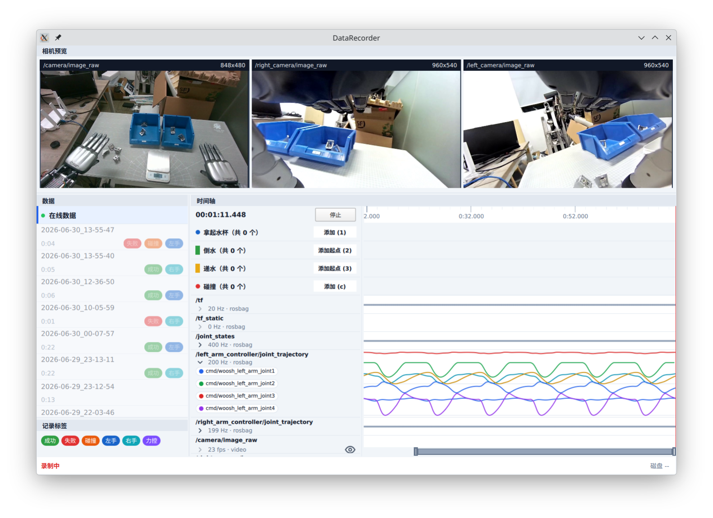

# Data Recorder

Data Recorder 是一个带图形界面的 ROS 2 数据录制工具。它可以实时查看话题和相机画面，将普通 ROS 2 话题录制为 rosbag、将图像话题录制为视频，并在录制过程中添加标签和时间标注。录制完成后，可以直接在界面中查看和回放历史数据。



## 使用方法

以下步骤以 Ubuntu 22.04 和 ROS 2 Humble 为例。开始前，请先安装 ROS 2 Humble，并安装 Git、rosdep 和 colcon：

```bash
sudo apt update
sudo apt install git python3-rosdep python3-colcon-common-extensions

# 本软件支持 db3 和 MCAP（推荐） 两种后端。如需使用 MCAP 后端，请执行：
sudo apt install ros-humble-rosbag2-storage-mcap
```

1. 创建 ROS 2 工作空间，并将本仓库克隆到工作空间的 `src` 目录：

   ```bash
   mkdir -p ~/ros2_recorder_ws/src
   cd ~/ros2_recorder_ws
   git clone https://github.com/MirTITH/ROS2-recorder.git src/data_recorder
   ```

2. 安装依赖：

   首次使用 rosdep 时，需要先初始化：

   ```bash
   sudo rosdep init
   rosdep update
   ```

   然后在工作空间根目录安装本项目依赖：

   ```bash
   cd ~/ros2_recorder_ws
   source /opt/ros/humble/setup.bash
   rosdep install --from-paths src --ignore-src -r -y
   ```

3. 构建工作空间：

   ```bash
   cd ~/ros2_recorder_ws
   source /opt/ros/humble/setup.bash
   colcon build --symlink-install
   ```

4. 编辑 [`config/example_config.yaml`](config/example_config.yaml)：

   - `output_dir`：录制数据的保存目录。
   - `tags`：可选择的会话标签。
   - `annotation_types`：时间标注及其快捷键；`point` 表示时间点，`range` 表示时间区间。
   - `groups`：需要录制的话题。使用 `rosbag` 后端录制普通话题，使用 `video` 后端将图像话题编码为视频。

5. 启动程序：

   ```bash
   cd ~/ros2_recorder_ws
   source /opt/ros/humble/setup.bash
   source install/setup.bash
   ros2 run data_recorder data_recorder \
     --ros-args -p config_file:="$HOME/ros2_recorder_ws/src/data_recorder/config/example_config.yaml"
   ```

6. 在界面中使用：

   - 点击“录制”开始采集，点击“停止”结束采集；也可以按空格键切换。
   - 录制时点击标签，为本次会话添加标签。
   - 点击时间标注按钮或按配置的快捷键添加标注。区间标注需要触发两次，分别设置起点和终点。
   - 在“数据”面板中选择历史会话，然后点击“播放”回放；点击“在线数据”返回实时视图。

每次录制都会在 `output_dir` 下生成一个独立的会话目录，其中包含 rosbag、视频及会话标注信息。
